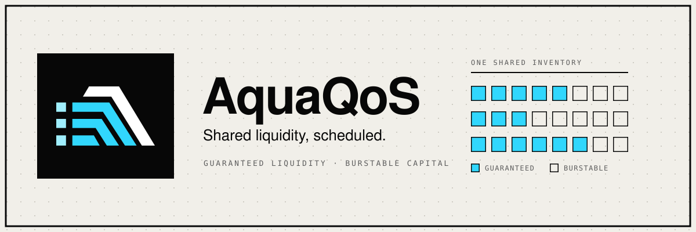
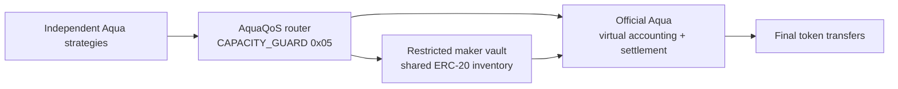
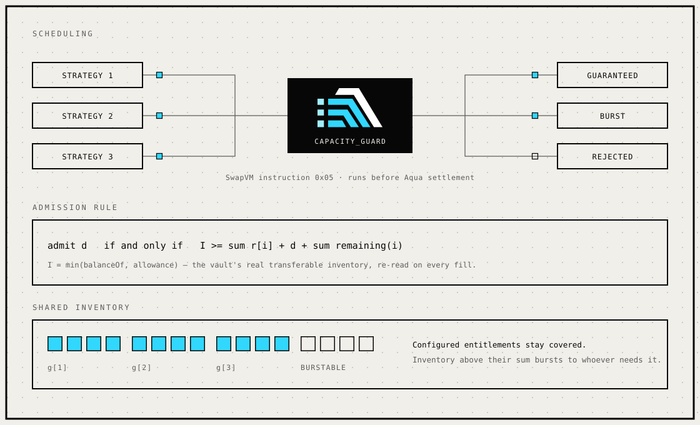

<div align="center">
  
</div>

<p align="center">
  <b>Protected-capacity scheduling for shared maker inventory on 1inch Aqua and SwapVM.</b>
</p>

<p align="center">
  
  
  <a href="docs/SEPOLIA_DEPLOYMENT.md"></a>
  <a href="LICENSES/"></a>
</p>

<p align="center">
  <a href="https://aquaqos.vercel.app"><b>Live app</b></a> &nbsp;·&nbsp;
  <a href="https://aquaqos.vercel.app/onchain/">Onchain proof</a> &nbsp;·&nbsp;
  <a href="https://aquaqos.vercel.app/docs/">Documentation</a> &nbsp;·&nbsp;
  <a href="docs/BENCHMARK_RESULTS.md">Benchmarks</a> &nbsp;·&nbsp;
  <a href="docs/CAPACITY_GUARD_SPEC.md">Specification</a>
</p>

---

## The problem

Aqua accounts virtual balances independently for each maker, app, strategy, and token. The
maker's real ERC-20 inventory stays shared.

Independent strategies can therefore each look funded at the virtual layer and still compete
for the same final token transfer. The second fill does not get a worse price — it fails, after
the quote was already given.

That failure is reproduced from source in the [problem reproduction](docs/PROBLEM_REPRODUCTION.md)
and held in place by Solidity tests.

## The mechanism

AquaQoS adds a `CAPACITY_GUARD` SwapVM instruction (opcode `0x05`) and a restricted maker
vault. The guard checks configured capacity before canonical Aqua settlement, records
transaction-scoped reservations, and leaves the official Aqua accounting and settlement path
load-bearing. AquaQoS decides admission — nothing else.



<div align="center">
  
</div>

- **Guaranteed** — no sibling fill is admitted that would leave a registered strategy's
  configured entitlement uncovered.
- **Burstable** — inventory above the sum of entitlements stays available to whoever needs it.
- **Decided before transfer** — an unservable fill reverts with `InsufficientCapacity` ahead of
  settlement, leaving tracked state and logs unchanged.

The strong form of that first property depends on the restricted vault: a normal wallet can
spend or approve inventory outside Aqua, so a registry alone cannot enforce the boundary. The
[guard specification](docs/CAPACITY_GUARD_SPEC.md) defines the supported domain, the admission
invariant, and the boundary conditions.

## Current state

A Solidity prototype with reproducible transaction receipts, state checks, benchmarks, a public
Sepolia proof, and a Next.js capacity workspace.

| Claim | Direct evidence |
| --- | --- |
| Shared-inventory settlement failure reproduced | [Problem reproduction](docs/PROBLEM_REPRODUCTION.md) and Solidity tests |
| Custom SwapVM opcode `0x05` executes before settlement | [`AquaQoSRouter.sol`](contracts/AquaQoSRouter.sol), [specification](docs/CAPACITY_GUARD_SPEC.md), and contract tests |
| Real balance and allowance protect sibling capacity | [`AquaQoSVault.sol`](contracts/AquaQoSVault.sol), model checks, and [rejection replay](docs/REJECTION_REPLAY.md) |
| Public token-transfer demonstration | [22 Sepolia transactions with exact-match source verification](docs/SEPOLIA_DEPLOYMENT.md) |
| Official deployed Aqua exercised with real token contracts | [Authenticated Ethereum-fork DAI/WETH proof](docs/FORK_PROOF.md) |
| Comparative trade-offs measured | [A/B/C/C100 methodology](docs/BENCHMARK_METHODOLOGY.md) and [results](docs/BENCHMARK_RESULTS.md) |
| Security assumptions and residual risk documented | [Release review](docs/SECURITY_REVIEW_RELEASE.md) and [release verification](docs/RELEASE_VERIFICATION.md) |

The retained checks behind those claims:

| Check | Scale |
| --- | ---: |
| Solidity tests | 30 |
| Fuzz properties | 3 × 256 runs |
| Bounded capacity-model cases | 327,168 |
| Replayed transactions | 239 |
| Comparative benchmark fixtures | 72 |
| Public Sepolia transactions | 22 |

These are scoped engineering results, not an external audit or production certification.

### Public deployment

| Component | Ethereum Sepolia |
| --- | --- |
| Official Aqua | [`0x4999…6d31`](https://sepolia.etherscan.io/address/0x499943e74fb0ce105688beee8ef2abec5d936d31) |
| AquaQoS router | [`0xE2EE…5496`](https://sepolia.etherscan.io/address/0xE2EE332421bb0aE4177d0dE764ce5969bA0A5496) · [exact source match](https://repo.sourcify.dev/11155111/0xE2EE332421bb0aE4177d0dE764ce5969bA0A5496) |
| AquaQoS vault | [`0x22a3…C252`](https://sepolia.etherscan.io/address/0x22a305FDB19C8856a427f4AEaB3264618Ca5C252) · [exact source match](https://repo.sourcify.dev/11155111/0x22a305FDB19C8856a427f4AEaB3264618Ca5C252) |

[Open the seven-step public transaction story](https://aquaqos.vercel.app/onchain/) or read the
[complete 22-transaction deployment record](docs/SEPOLIA_DEPLOYMENT.md).

## The measured cost

The guard reads sibling state on every fill, and that is not free. At eight strategies, the
median measured gas was:

| Path (8 strategies, median) | Unguarded | Guarded |
| --- | ---: | ---: |
| Low-contention successful swap | 113,715 | 210,099 |
| Unservable overload fill | 126,779 <sub>fails at settlement</sub> | 146,465–147,137 <sub>guard rejection</sub> |

Low contention is a neutral volume case where the guard only adds gas — about 84.8% overhead.
Rejecting earlier is not the same as rejecting cheaply. Higher fill volume at smaller configured
guarantees is also not an equal-protection efficiency claim; at equal initial protected
allocation, the guarded policy matches raw Aqua's overload fill volume. Guard rejections are
counted separately from settlement failures throughout, and all attempted demand is reported.
Full methodology and every fixture are in the [benchmark results](docs/BENCHMARK_RESULTS.md).

## Supported scope

**v0 supports**

- one immutable token pair with standard ERC-20 behavior;
- up to eight fee-free canonical XYC strategies;
- pinned Aqua/SwapVM code and a non-upgradeable restricted maker vault.

**v0 does not claim**

- general solvency, profitability, or price quality;
- hostile-token coverage — fee-on-transfer, rebasing, and callback-bearing tokens are outside
  the supported domain;
- universal gas bounds;
- an external audit.

**Known conservative behaviour**

- Reservations last until transaction end, which can reject otherwise safe sequential fills in
  the same transaction.
- Extreme upstream input-ledger values can quote and then revert atomically during settlement.

## Verify from source

Exact source identities are pinned in [sources.lock.json](sources.lock.json) and the dependency
lockfile. With Node 22.16.0 and pnpm 11.10.0, the core gate recompiles the protocol and runs
30 Solidity tests:

```sh
pnpm install --frozen-lockfile --ignore-scripts
pnpm build
pnpm test
```

For the full model, benchmark and deployment verification matrix, follow the
[reproduction guide](https://aquaqos.vercel.app/docs/reproduce/). `pnpm check:sepolia`
re-queries Sepolia and Sourcify rather than trusting the committed report.

## Product surfaces

The [public Next.js app](https://aquaqos.vercel.app) is the product and developer entry point:

| Surface | Purpose |
| --- | --- |
| [Landing](https://aquaqos.vercel.app) | Understand the shared-inventory problem and mechanism |
| [Workspace](https://aquaqos.vercel.app/workspace/) | Compare checked A/B/C benchmark transactions across 2/4/8 strategies |
| [Onchain](https://aquaqos.vercel.app/onchain/) | Inspect Sepolia contracts, source matches and representative receipts |
| [Proof](https://aquaqos.vercel.app/proof/) | Trace claims to specifications, tests and raw evidence |
| [Docs](https://aquaqos.vercel.app/docs/) | Read the curated protocol, security and reproduction guide |

The public site does not pretend recorded evidence is a live wallet. A separate local execution
lab remains available to contributors through the [reproduction guide](web/content/docs/reproduce.mdx).

```sh
pnpm --dir web install --frozen-lockfile --ignore-scripts
pnpm --dir web build
pnpm --dir web dev
```

The static export revalidates its benchmark evidence before building. The committed Vercel
configuration needs no runtime secret or blockchain RPC.

## Repository map

| Path | Contents |
| --- | --- |
| `contracts/`, `test/` | Protocol implementation and Solidity tests |
| `scripts/` | Reproducible model, evidence, deployment, and release checks |
| `benchmarks/`, `benchmarks/raw/` | Comparative measurements and retained raw reports |
| `deployments/` | Local, fork, and Sepolia runtime identities, receipts, and source authentication |
| `web/` | Next.js App Router workspace, evidence page, and Fumadocs documentation (`web/content/docs/`) |
| `docs/` | Protocol, benchmark, security, requirements, and release documentation |
| `docs/archive/` | Development history and event-required provenance, outside the product documentation path |
| `LICENSES/` | Retained upstream and dependency license texts and notices |

The public technical path is this README, the [app](https://aquaqos.vercel.app), and the curated
[documentation](https://aquaqos.vercel.app/docs/). Maintainer records stay archived and auditable
without appearing in the primary product path.

## Licensing and provenance

This repository is source-available under mixed licenses — no single license applies to every
file, and it is not OSI-licensed as a whole. Read the retained texts in [`LICENSES/`](LICENSES/)
and the [third-party notices](docs/THIRD_PARTY.md) before reuse or deployment.

The project was started during ETHOnline 2026. Event requirements and submission records are
archived under [docs/archive/ethonline-2026/](docs/archive/ethonline-2026/) and do not define
the protocol itself.

---

<p align="center">
  <b>Powered by Aqua — © Degensoft Ltd 2025.</b><br>
  <b>Powered by SwapVM — © Degensoft Ltd 2025.</b>
</p>
