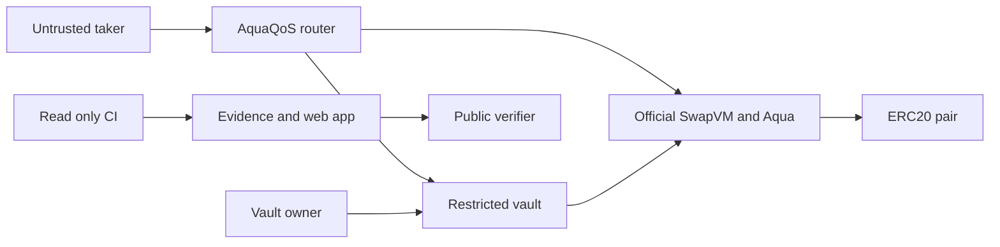

# AquaQoS threat model

Updated 2026-09-11. This document consolidates the implemented v0 trust boundaries and the
existing security reviews; it is not a new external audit.

## Executive summary

The most important risks are loss of the vault-owner key, using tokens or programs outside
the narrow supported domain, and mistakes at the boundary between Aqua virtual balances and
the vault's real transferable inventory. AquaQoS reduces that accounting risk with immutable
dependencies, a restricted vault, canonical programs, bounded strategy enumeration, transient
reservations, and settlement-time rechecks. Residual risk remains too high for real-value use.

## Scope and assumptions

In scope: `contracts/`, pinned Aqua/SwapVM settlement, owner lifecycle operations, standard
ERC-20 inventory/allowance, SwapVM quote/swap entry points, the local live runner, retained
evidence, and release CI. The public Sepolia deployment uses valueless owner-mintable demo
tokens. The Next.js application displays or initiates local demonstration actions; it does
not hold signing keys.

Out of scope: mainnet assets, hostile/rebasing/fee-on-transfer/callback-bearing tokens,
arbitrary SwapVM programs, more than eight strategies, protocol fees, upgrades, legal
solvency, profitability, and availability of third-party RPC/explorer services.

Risk would materially change if the vault held real-value assets, if `/live/` were exposed as
an Internet service, or if additional token/program types were admitted without new tests.

## System model

### Primary components

- `AquaQoSVault`: maker custody, strategy registration, guarantees, lifecycle, and capacity state.
- `AquaQoSRouter`: custom `CAPACITY_GUARD` opcode followed by official SwapVM execution.
- Official Aqua: independent virtual balances and final ERC-20 settlement.
- ERC-20 pair: real vault inventory and Aqua allowance.
- Taker/callback contract: untrusted swap caller and payment source.
- Owner: trusted lifecycle administrator; its key is outside this repository.
- Web/replay tooling: demonstration and evidence readers, separate from contract authorization.

### Data flows and trust boundaries

- Taker → router: public calldata and payment callback behavior; canonical program shape and
  settlement constraints are validated by the router and pinned SwapVM.
- Router → vault: order hash, output token, and final debit; only the immutable router can
  create a transient reservation.
- Vault → Aqua: ship/dock lifecycle calls and unlimited pair-token approval; owner-only vault
  lifecycle and immutable Aqua/router addresses constrain this boundary.
- Aqua → token: final maker pull and taker transfer; capacity uses the minimum of actual balance
  and current Aqua allowance, while unsupported token semantics remain an explicit exclusion.
- Owner → vault: configuration, pause, dock, and withdrawal; authorization is a single immutable
  address and lifecycle calls reject after an in-transaction reservation.
- Repository → CI/web: committed source and evidence are parsed and rendered; frozen lockfiles,
  evidence checkers, read-only CI permissions, and no CI secrets protect this boundary.

#### Diagram

## Assets and security objectives

| Asset | Why it matters | Objective |
| --- | --- | --- |
| Vault token inventory and allowance | Backs every protected strategy and final settlement | Integrity, availability |
| Guarantee configuration and strategy set | Defines the protected-capacity policy | Integrity |
| Aqua virtual balances | Drive pricing, entitlement consumption, and replenishment | Integrity |
| Owner signing key | Can pause, dock, and withdraw the group | Confidentiality, integrity |
| Source pins and deployment identity | Bind claims to official Aqua/SwapVM and deployed code | Integrity |
| Receipts, traces, and benchmark reports | Support every measured public claim | Integrity, availability |

## Attacker model

### Capabilities

An attacker can call public quote/swap functions, choose amounts and direction, deploy a taker
callback, attempt nested sibling execution, call permissionless Aqua entry points, observe all
state and transactions, and provide malformed evidence to local readers.

### Non-capabilities

The attacker is not assumed to possess the owner key, change immutable contract addresses,
rewrite finalized chain history, or introduce an unsupported token into an already-deployed
immutable pair. Compromise of the developer or owner environment is modeled separately.

## Entry points and attack surfaces

| Surface | Boundary | Existing control | Evidence |
| --- | --- | --- | --- |
| `quote` / `swap` | Taker → router | Canonical wrapper, fee-free program, live capacity recheck | `contracts/AquaQoSRouter.sol::_runOpcode` |
| `reserve` | Router → vault | Immutable-router authorization and transient reservation | `contracts/AquaQoSVault.sol::reserve` |
| Strategy lifecycle | Owner → vault | Immutable owner, paused-state rules, transaction touched flag | `contracts/AquaQoSVault.sol::lifecycle` |
| Aqua settlement | Aqua → vault/token | Real balance and allowance floor plus upstream atomic revert | `AquaQoSVault.inventory`, `checkCapacity` |
| Taker callbacks | Router → untrusted contract | Reservation visibility, per-order locks, atomic rollback | `test/AquaQoSCallbacks.t.sol` |
| Evidence export | Repository → web | Schema/integrity check before copying retained data | `web/scripts/prepare-evidence.mjs` |
| Local live server | Browser → local runner | Intended loopback-only demonstration environment | `scripts/serve-live.mjs` |

## Top abuse paths

1. Compromise the owner key, pause and dock the group, then withdraw all inventory.
2. Admit a non-standard token whose transfer or balance semantics violate capacity accounting.
3. Nest a sibling swap during a callback to consume inventory not visible to the outer order.
4. Manipulate virtual balances or allowance so a quote succeeds but settlement later reverts.
5. Register enough strategies or craft calls that make the bounded scan an availability cost.
6. Alter retained evidence or UI labels so local/mock results appear to be public-chain proof.
7. Compromise a dependency or CI action to alter builds or exfiltrate future release secrets.

## Threat model table

| ID | Threat | Existing controls | Gap / recommendation | Likelihood | Impact | Priority |
| --- | --- | --- | --- | --- | --- | --- |
| TM-001 | Owner-key compromise enables full lifecycle control and withdrawal | Immutable owner; no generic call or upgrade path | Use a dedicated hardware-backed key or multisig before real-value use; monitor lifecycle events | Low in demo | High | High |
| TM-002 | Unsupported token behavior invalidates balance, allowance, or transfer assumptions | Immutable sorted pair; scope explicitly excludes hostile tokens | Maintain an allowlist and token-specific tests before expanding deployment scope | Medium if scope expands | High | High |
| TM-003 | Callback nesting consumes sibling capacity during an admitted fill | Transient reservations, touched flag, rollback and callback tests | Extend mixed-direction/deeper nesting tests before widening program support | Low | High | Medium |
| TM-004 | Linear sibling reads cause gas griefing or unavailable quotes/swaps | Hard maximum of eight; measured lifecycle and swap gas | Keep the bound; raise it only with new worst-case measurements | Medium | Medium | Medium |
| TM-005 | Quote/swap divergence or extreme arithmetic causes atomic settlement failure | Execution-time recheck, checked arithmetic, numeric rollback tests | Keep bounded inputs; expose quote expiry/state assumptions in clients | Medium | Medium | Medium |
| TM-006 | Evidence or UI mislabels local/mock behavior as Sepolia/public behavior | Retained receipts, source hashes, evidence checkers, explicit environment labels | Keep one verified claim map and test all public labels/links | Medium | Medium | Medium |
| TM-007 | Dependency or CI compromise changes the verified build | Pinned source SHAs, frozen lockfiles, full-SHA actions, read-only CI | Review dependency updates manually; enable GitHub security alerts | Low | High | Medium |
| TM-008 | Local live runner is exposed to untrusted Internet users | Designed for isolated loopback use with test accounts | Never host it as a public transaction service without authentication, rate limits, isolation, and a separate review | Low under assumption | High | Medium |

No critical item is assigned because the supported deployment contains no real-value assets
and is explicitly non-production. TM-001 or TM-002 becomes critical if that assumption changes.

## Criticality calibration

- Critical: direct, practical loss of real-value vault inventory or remote compromise of a
  production signing/runtime environment.
- High: complete policy bypass, unauthorized lifecycle control, or reliable protected-capacity
  violation under the documented supported domain.
- Medium: atomic settlement failure, bounded denial of service, misleading evidence, or a
  weakness requiring unsupported configuration or significant preconditions.
- Low: low-impact information disclosure or recoverable presentation defects with no effect
  on protocol or evidence integrity.

## Focus paths for security review

| Path | Reason | Threats |
| --- | --- | --- |
| `contracts/AquaQoSRouter.sol` | Custom VM entry/exit and final-debit enforcement | TM-003, TM-005 |
| `contracts/AquaQoSVault.sol` | Custody, authorization, lifecycle, and accounting invariant | TM-001–TM-005 |
| `test/AquaQoSCallbacks.t.sol` | Nested execution and rollback assumptions | TM-003 |
| `test/AquaQoSConservatism.t.sol` | Same-transaction and allowance limitations | TM-003, TM-005 |
| `scripts/check-sepolia.mjs` | Public deployment and receipt authentication | TM-006 |
| `scripts/check-release-evidence.mjs` | Retained trace/source integrity | TM-006, TM-007 |
| `scripts/serve-live.mjs` | Local-only execution boundary | TM-008 |
| `.github/workflows/ci.yml` | Build dependency and token permissions | TM-007 |

## Quality check

- Runtime, public-chain evidence, local tooling, and CI are separated.
- Every identified trust boundary is represented by an abuse path or threat.
- Contract, callback, lifecycle, evidence, and local-server entry points are covered.
- Assumptions and the deployment changes that would increase risk are explicit.
